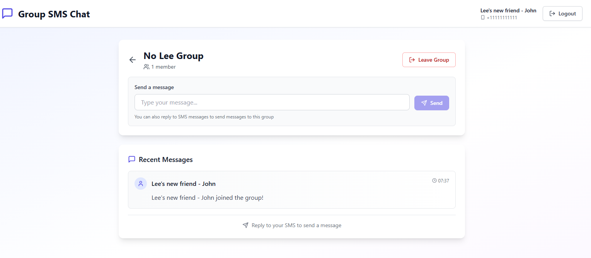
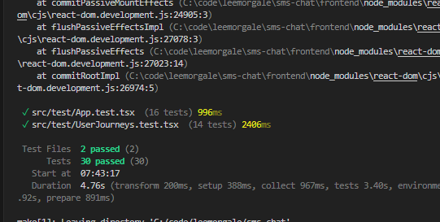
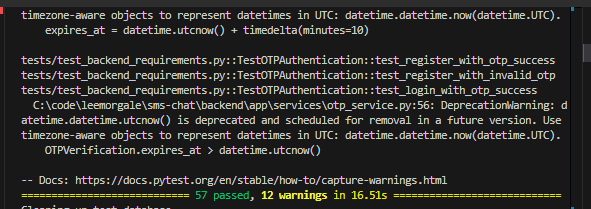
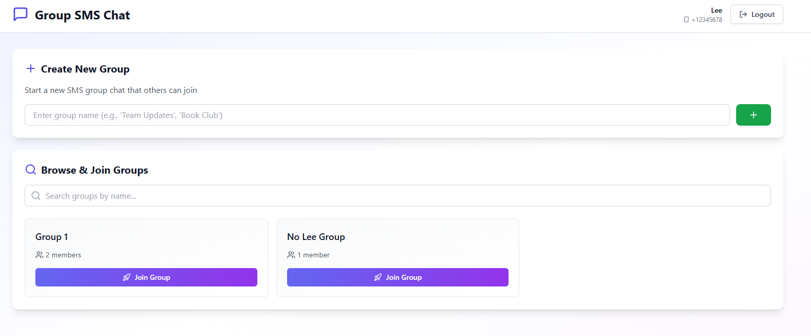
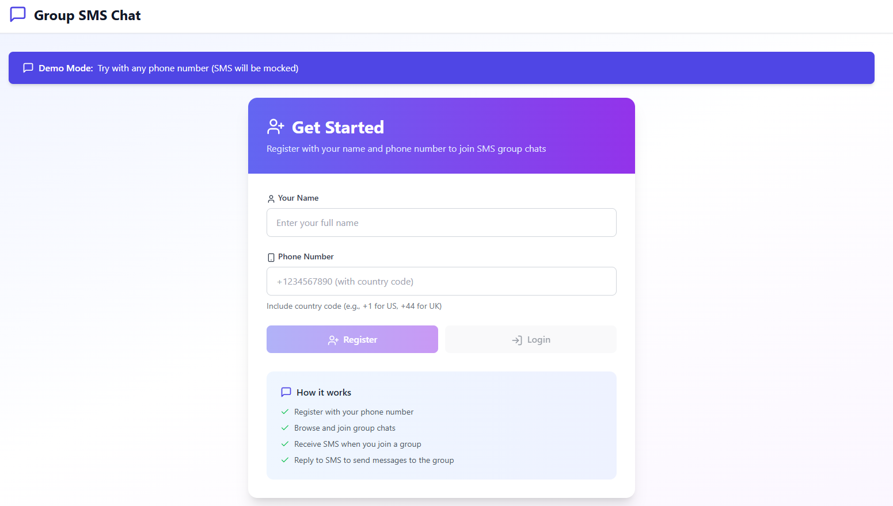
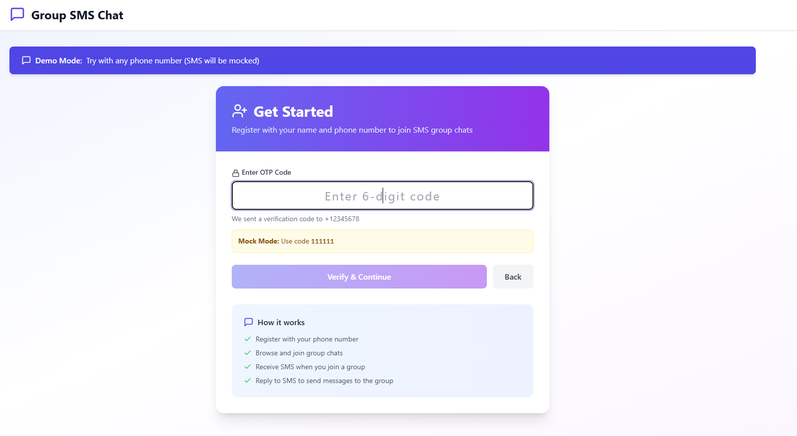
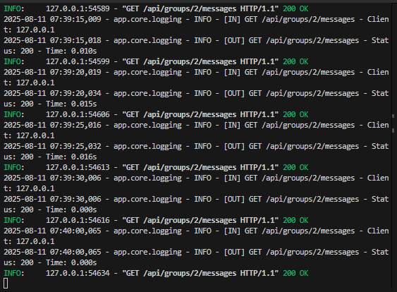

# SMS Chat Application

A modern web application that enables group chat functionality over SMS, built with FastAPI (Python) backend and React frontend.

<!-- Demo -->
<p align="center">
  <video src="media/demo.mp4" controls width="860"></video>
</p>
<p align="center">
  <em><a href="media/demo.mp4">Download/view the demo video</a></em>
</p>

<!-- Screenshots -->
<p align="center">
  
  
  
</p>

<p align="center">
  
  
  
</p>

<p align="center">
  
</p>

### 2) Fix React Router future flag warnings
Add future flags to your router in `frontend/src/App.tsx`:
```tsx
// change this ...
<Router>

// to this ...
<Router
  future={{
    v7_startTransition: true,
    v7_relativeSplatPath: true,
  }}
>
```

### 3) Quiet the “invalid JSON” console error in tests (optional)
In the specific test that intentionally loads invalid JSON (Vitest), temporarily silence `console.error`:
```ts
const errorSpy = vi.spyOn(console, 'error').mockImplementation(() => {});

try {
  // ... render and run this test block ...
} finally {
  errorSpy.mockRestore();
}
```

- Place that in `src/test/App.test.tsx` inside the “does not crash when localStorage contains invalid JSON” test. Tests already pass; this just cleans noisy logs.

- Commit assets and README:
```bash
git add README.md docs/images/*.png
git commit -m "Add demo video & screenshots at top of README; enable router future flags; quiet test console error"
```

- If `vid.mp4` is large (>100MB), consider Git LFS:
```bash
git lfs install
git lfs track "*.mp4"
git add .gitattributes vid.mp4
git commit -m "Track demo video with Git LFS"
```

- Re-run tests:
```bash
make test-frontend
```

- Everything important:
  - README now shows video and screenshots at the top.
  - Router warnings removed by adding `future` flags.
  - Optional test log noise suppressed via `console.error` spy.

## 🚀 Quick Start

### First Time Setup
```bash
make start    # Install dependencies, setup database, and run app
```

### Daily Use (Recommended: Use 2 Terminals)

**Terminal 1 - Backend:**
```bash
make run-backend   # Starts FastAPI on http://localhost:8000
```

**Terminal 2 - Frontend:**
```bash
make run-frontend  # Starts React on http://localhost:3000
```

**Or run both in one terminal:**
```bash
make run          # Runs both (but harder to see individual logs)
make stop         # Stop the app
```

### Testing & Quality
```bash
make test          # Run all tests (backend + frontend)
make test-backend  # Run backend tests only
make test-frontend # Run frontend tests only
make lint          # Run code linting
```

**Note**: Backend tests use a separate temporary database (`sms_chat_test_db`) that is created, migrated, tested, and cleaned up automatically. This ensures tests never interfere with your main application database.

### Database Management
```bash
make reset    # Reset database to clean state
```

---

## 📍 Access Points
- **Frontend**: http://localhost:3000
- **Backend API**: http://localhost:8000/docs

---

## Features

- **User Management**: Register/login with phone number
- **Group Management**: Create, search, join, and leave groups  
- **SMS Integration**: Send and receive group messages via SMS using Twilio
- **Real-time Updates**: Auto-refresh messages in the web interface
- **Multi-group Support**: Users can participate in multiple groups simultaneously

## Design Assumptions

Based on the MVP requirements:

- **All groups are public** - Any user can search for and join any group
- **No authentication required** - Users identify by phone number only
- **No group ownership** - Groups exist independently, no admin/owner roles
- **Simple message format** - Text only, no media or attachments
- **No message history limit** - All messages are stored and displayed
- **No user profiles** - Just name and phone number, no avatars or bios
- **One-way SMS binding** - Each user uses the same phone number for all groups

## Tech Stack

- **Backend**: FastAPI, SQLAlchemy, PostgreSQL, Alembic migrations
- **Frontend**: React, React Router, Axios
- **SMS Service**: Twilio API
- **Database**: PostgreSQL (runs in Docker automatically)

## Prerequisites

- Docker (for PostgreSQL database)
- Python 3.11+
- Node.js 18+
- Make command

## Environment Setup

**Note**: Environment is auto-configured! But if you want to customize:

1. Copy environment file:
```bash
cp backend/.env.example backend/.env
```

2. Edit `backend/.env` and set:
```
MOCK_SMS=true    # For testing without Twilio
```

## All Available Commands

Run `make` or `make help` to see all commands:

```bash
make start        # 🚀 Start the app (first time setup + run)
make run          # 🏃 Run the app (daily use)
make reset        # 🔄 Reset app with fresh data  
make stop         # 🛑 Stop the app

# Database Commands
make db-migrate   # Run database migrations
make db-reset     # Reset database (clean slate)
make db-fresh     # Reset database + add demo data
make db-seed      # Add demo data to existing DB

# Other Commands
make install      # Install dependencies
make test         # Run all tests
make lint         # Run linting
make clean        # Clean up files
make status       # Check app status
```

## Setting Up Twilio

### Option 1: Mock Mode (For Development)
Already configured in `.env.example` with `MOCK_SMS=true`.
This logs SMS messages to console instead of sending them.

### Option 2: Real Twilio Integration
1. Create a Twilio account at https://www.twilio.com
2. Get a phone number capable of sending/receiving SMS
3. Update `.env` with your credentials:
   - `TWILIO_ACCOUNT_SID`
   - `TWILIO_AUTH_TOKEN` 
   - `TWILIO_PHONE_NUMBER`
4. Set `MOCK_SMS=false`

## How Twilio Phone Pool Works

This app uses a **hybrid SMS routing system** that intelligently manages how groups communicate via SMS:

### Phone Pool System
- Each group ideally gets its own dedicated Twilio phone number
- When a user joins a group, they receive a welcome SMS from that group's number
- Users can simply reply to that number to send messages to the group
- No special commands needed - just text naturally!

### Adding Twilio Numbers to the Pool
Currently, phone numbers are managed directly in the database:

1. **Via Database**: Add phone numbers to the `phone_numbers` table
2. **Status Management**: Numbers have three states:
   - `AVAILABLE` - Ready to be assigned to a group
   - `ASSIGNED` - Currently used by a group
   - `DISABLED` - Not available for use

### Fallback System
When all phone numbers in the pool are assigned:
- Groups share the main Twilio number (from .env)
- Users prefix messages with `@"Group Name"` to route to specific groups
- Example: `@"Book Club" What's our next book?`

### Benefits
- **Better UX**: Each group feels like a natural SMS conversation
- **Scalable**: Add more numbers as you grow
- **Flexible**: Automatic fallback ensures the system always works

## Usage

1. **Register**: Create account with name and phone number
2. **Browse Groups**: Search and view available groups
3. **Join Groups**: Click "Join Group" to participate
4. **Send Messages**: Reply to SMS you receive after joining
5. **Multi-group**: Use `@"Group Name" message` format for multiple groups

## Troubleshooting

### Database Issues
```bash
make reset        # Reset everything fresh
make status       # Check what's running
```

### Port Already in Use
```bash
make stop         # Stop all services
make run          # Start again
```

### Fresh Start
```bash
make stop
make reset
make run
```

## API Endpoints

- `POST /api/users/` - Create new user
- `GET /api/users/` - List all users  
- `GET /api/groups/` - List/search groups
- `POST /api/groups/` - Create new group
- `POST /api/groups/{id}/join/{user_id}` - Join group
- `POST /api/groups/{id}/leave/{user_id}` - Leave group
- `GET /api/groups/{id}/messages` - Get group messages
- `POST /api/sms/webhook` - Twilio webhook endpoint

## Development

The application uses:
- **Hot Reload**: Both backend and frontend support hot reloading
- **CORS**: Configured for local development  
- **Database**: PostgreSQL with Alembic migrations
- **Auto-setup**: Make commands handle all setup automatically
